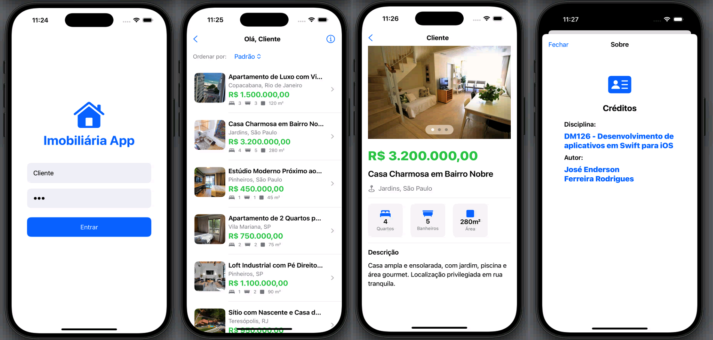

# Pós-Graduação em Desenvolvimento Mobile e Cloud Computing – Inatel
## DM126 - Desenvolvimento de aplicativos em Swift para iOS

## Projeto Final da Disciplina

### 👤 Autor: 
José Enderson Ferreira Rodrigues   
jose.rodrigues@pg.inatel.br, jose.e.f.rodrigues.br@gmail.com

## 📌 Implementação
Aplicativo de imobiliária para plataforma iOS com SwiftUI desenvolvido no X-Code

### Requisitos atendidos e recursos empregados:
✅ O app deve implementa a arquitetura declarativa vista nas aulas (Tipo de dados -> SubViews (Models) -> View Final)

✅ O app contém autenticação e uma tela de login

✅ NavigationStack: Permite que o aplicativo se mova entre as telas (LoginView -> ListaImoveisView -> DetalheImovelView)

✅ VStack: Usado para empilhar elementos verticalmente

✅ HStack: Usado para empilhar elementos horizontalmente

✅ ZStack: Usado para sobrepor views

✅ ScrollView: Usado na DetalheImovelView para permitir que o conteúdo (descrição, características) seja rolado, especialmente quando excede o tamanho da tela

✅ List: Usado na ListaImoveisView para exibir o conjunto de imóveis de forma eficiente e estruturada, aproveitando recursos como rolagem otimizada

✅ Spacer: Usado para empurrar elementos e criar espaço flexível

✅ Button: Usado para ações claras (Ex: Botão "Entrar" na LoginView, e o próprio botão "Voltar" dentro do CustomNavigationBar)

✅ TextField / SecureField: Usados para entrada de texto pelo usuário

✅ Picker: Usado na ListaImoveisView com o estilo .menu para permitir a seleção de opções de ordenação ("Preço" e "Quartos"), funcionando como um dropdown.

✅ Text: Usado extensivamente para títulos, rótulos, preços, descrições e o nome de usuário logado.

✅ Image: Usado para exibir gráficos:

* Imagens estáticas e miniaturas (conteúdo presente em Assets.xcassets).
    
* Ícones do sistema (SF Symbols) através de Image(systemName: "...") (Ex: house.fill na logo, chevron.left na navegação, e os ícones de FeatureBadge).]
    

✅ Divider: Usado para separar visualmente as seções de conteúdo na DetalheImovelView.

✅ CustomNavigationBar: Substitui a barra de navegação padrão com comportamento personalizado.

✅ FeatureBadge: Usado para exibir características do imóvel (quartos, banheiros, área) de forma modular.

✅ CarrosselImagensView: Usado para exibir as imagens de detalhes do imóvel.

## 📌 Imagens do projeto 
<br>  

## 📌 Organização do projeto
Aplicativo de imobiliária para plataforma iOS com SwiftUI desenvolvido no X-Code

### Models (3 Arquivos)

- Imovel.swift
- Usuario.swift
- DataSourceMock.swift

### Componentes reutilizáveis (3 Arquivos)

- CustomNavigationBar.swift
- CarrosselImagensView.swift
- FeatureBadge.swift 

### Views (5 Arquivos)

- LoginView.swift
- LinhaImovelView.swift
- ListaImoveisView.swift
- DetalheImovelView.swift
- ContentView.swift
- CreditosView.swift

### App (1 Arquivo)

- App_ImobiliariaApp.swift

## 📌 Detalhamento da solução

#### 📂 Estrutura de pastas do projeto
```
📦 App_ImobiliariaApp
 ┣📂Carousel                        # Carrossel de imagens
 ┃ ┗📜CarrosselImagensView.swift   
 ┣📂Grid                           # Listagem e detalhamento dos anúncios
 ┃ ┣📜CreditosView.swift
 ┃ ┣📜DetalheImovelView.swift
 ┃ ┣📜FeatureBadge.swift
 ┃ ┣📜LinhaImovelView.swift   
 ┃ ┗📜ListaImoveisView.swift  
 ┣📂Login                          # Tela de login
 ┃ ┗📜LoginView.swift 
 ┣📂Model                          # Mocks e tipos de dados
 ┃ ┣📜DataSourceMock.swift
 ┃ ┣📜Imovel.swift  
 ┃ ┗📜Usuario.swift 
 ┣📂NavigationBar                  # Barra de navegação do aplicativo
 ┃ ┗📜CustomNavigationBar.swift            
 ┣📜App_ImobiliariaAppApp.swift    
 ┗📜ContentView.swift             
```

## 🛠️ IDE
- **X-Code**

## 💻 Linguagem
- **Swift**
